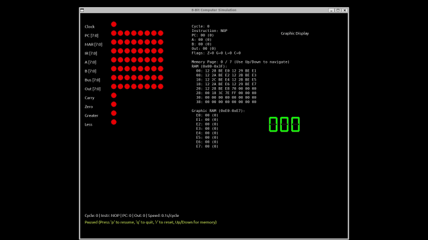
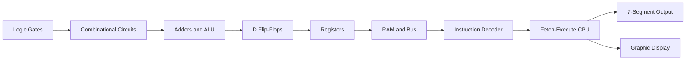
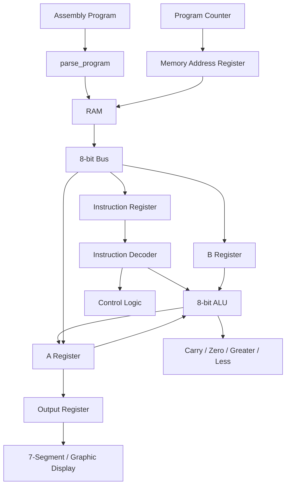
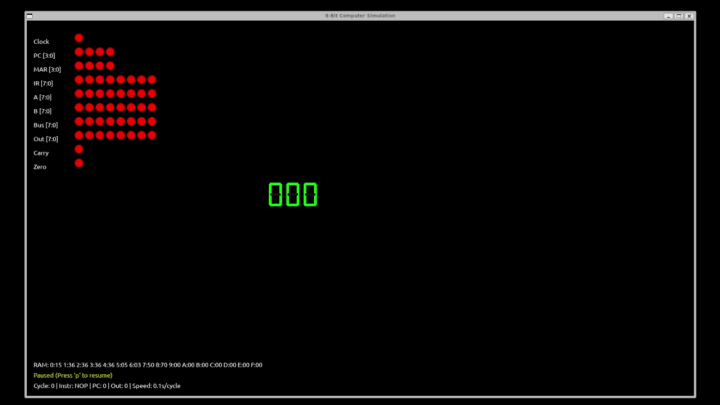

# 8-bit Computer

> A software-built 8-bit computer constructed from digital logic components, from gates to CPU execution and display output.




This project takes the hardware-first path. Instead of starting from a high-level CPU emulator, it builds the computer upward from logic gates, flip-flops, registers, an ALU, RAM, an instruction decoder, and a clocked fetch-execute loop.

## Table of Contents

- [Overview](#overview)
- [Build Roadmap](#build-roadmap)
- [Architecture](#architecture)
- [Circuit Gallery](#circuit-gallery)
- [Features](#features)
- [Quick Start](#quick-start)
- [Example](#example)
- [Documentation](#documentation)
- [Project Structure](#project-structure)
- [License](#license)

## Overview

Most CPU simulators hide the hardware underneath the instruction set. This project does the opposite: every major part of the computer is modeled as a digital circuit concept and then connected into a working 8-bit system.

The result is a visual simulator that shows the program counter, memory address register, instruction register, A/B registers, shared bus, ALU flags, output register, RAM state, 7-segment output, and an 8x8 graphic display variant.

## Build Roadmap



## Architecture



The simulator advances through a clocked fetch-execute cycle. Registers are updated with rising-edge D flip-flop behavior, so values are latched on clock transitions instead of being assigned as direct high-level emulator state.

More detail: [Architecture Notes](./docs/architecture.md) and [Runtime Structure](./docs/runtime.md).

## Circuit Gallery

### Full System Demo


[Original MP4](./docs/full-system-demo.mp4)

### ALU Signal Trace


The ALU trace shows input buses, opcode lines, output bits, latched Q bits, and status flags over simulated time.



[Original MP4](./docs/alu-test.mp4)

### D Flip-Flop Timing


The flip-flop timing view shows D, clock, Q, and inverted Q behavior, demonstrating how sequential state changes only on clock edges.

## Features

- Built from basic digital logic concepts
- Hardware-style clock simulation
- Rising-edge D flip-flop register updates
- 8-bit ALU with arithmetic, comparison, and flags
- Program counter, memory address register, instruction register, and shared bus
- RAM-backed assembly execution
- Fetch-execute CPU loop
- 7-segment output display
- 8x8 graphic display variant
- Waveform and timing visualizations

## Quick Start

The setup below assumes Ubuntu 22.04.

```bash
sudo apt update
sudo apt install -y python3 python3-venv python3-pip graphviz \
  libsdl2-dev libsdl2-image-dev libsdl2-mixer-dev libsdl2-ttf-dev
```

```bash
python3 -m venv .venv
source .venv/bin/activate
pip install -r requirements.txt
```

Run the base CPU simulator:

```bash
python src/8bit_computer.py
```

Run the graphic display simulator:

```bash
python src/8bit_computer_graphic.py
```

Controls:

- `p`: pause or resume
- `r`: reset
- `q`: quit
- `+`: slow the clock
- `-`: speed up the clock
- `Up` / `Down`: navigate memory pages in the graphic simulator

## Example

The base simulator runs this program:

```asm
LDA 10;
CMP 11;
JNE 6;
LDA 12;
OUT;
HLT;
LDA 13;
OUT;
HLT
```

The CPU preloads `RAM[10] = 5`, `RAM[11] = 3`, `RAM[12] = 8`, and `RAM[13] = 9`. Since `5 != 3`, `JNE 6` jumps to the second output path and the display shows:

```text
9
```

More examples: [Instruction Set](./docs/instruction_set.md).

## Documentation

- [Architecture Notes](./docs/architecture.md)
- [Runtime Structure](./docs/runtime.md)
- [Instruction Set](./docs/instruction_set.md)
- [Circuit Experiments](./notebooks/circuit.ipynb)
- [Circuit Tests](./notebooks/circuit_test.ipynb)

## Project Structure

```text
8bit-computer/
├── src/
│   ├── 8bit_computer.py
│   └── 8bit_computer_graphic.py
├── notebooks/
│   ├── circuit.ipynb
│   └── circuit_test.ipynb
├── docs/
│   ├── architecture.md
│   ├── runtime.md
│   ├── instruction_set.md
│   ├── full-system-demo.gif
│   ├── full-system-demo.mp4
│   ├── alu-test.gif
│   ├── alu-test.mp4
│   ├── alu-offset-visualization.png
│   └── d-flip-flop-oscilloscope.png
├── requirements.txt
├── README.md
└── LICENSE
```

## License

This project is licensed under the Apache License 2.0. See [LICENSE](./LICENSE).
