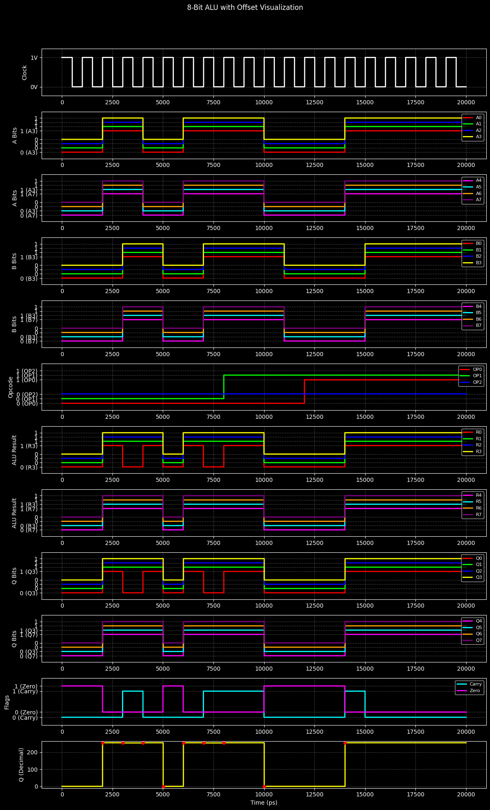
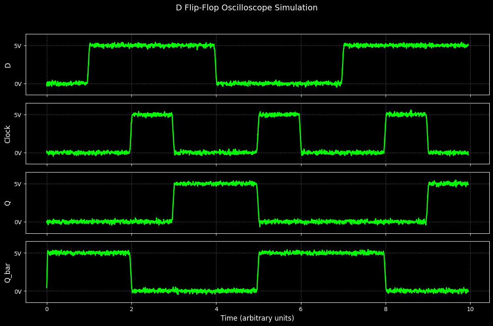

# 8-bit Computer

> A software implementation of an 8-bit computer built entirely from digital logic components.


---

## Table of Contents

- [Overview](#overview)
- [Features](#features)
- [Visuals and Demos](#visuals-and-demos)
- [Architecture](#architecture)
- [Project Structure](#project-structure)
- [Installation](#installation)
- [Usage](#usage)
- [Runtime Structure](#runtime-structure)
- [Instruction Set](#instruction-set)
- [Example](#example)
- [Motivation](#motivation)
- [Future Work](#future-work)
- [References](#references)
- [License](#license)

## Overview

This project recreates a complete 8-bit computer in software using fundamental digital logic principles. Every component, from logic gates to the CPU, is implemented from scratch without relying on existing CPU emulators.

The goal is to understand how modern computers work by constructing each hardware module step by step.

## Features

- Logic gates
- Combinational circuits
- Sequential circuits
- ALU
- Registers
- Program Counter
- RAM
- Instruction Decoder
- Control Unit
- 8-bit CPU
- Assembly execution

## Visuals and Demos

The project includes waveform-style visualizations and short demo recordings that show the simulated circuits running over time.

### Full System Demo

<video src="./docs/full-system-demo.mp4" autoplay muted loop playsinline controls width="100%">
  Your browser does not support the video tag.
</video>

This is the main demo of the project. It shows the completed 8-bit computer running with display output, tying together the CPU, registers, memory, ALU, control logic, and output path.

### 8-bit ALU Signal Trace



This trace shows the ALU clock, A and B input buses, opcode lines, ALU output, latched Q output, and status flags. It is useful for checking how arithmetic and logic operations propagate through the simulated 8-bit data path.

<video src="./docs/alu-test.mp4" autoplay muted loop playsinline controls width="100%">
  Your browser does not support the video tag.
</video>

### D Flip-Flop Timing



This oscilloscope-style view shows the D input, clock, Q output, and inverted Q output. It demonstrates that the sequential logic updates on the clock edge while preserving state between clock transitions.

## Architecture

```text
                 +----------------------+
                 |      CPU             |
                 |                      |
                 |  +---------------+   |
Input ---------> |  | Registers     |   |
                 |  +---------------+   |
                 |          |           |
                 |  +---------------+   |
                 |  | ALU           |   |
                 |  +---------------+   |
                 |          |           |
                 |  +---------------+   |
                 |  | Control Unit  |   |
                 |  +---------------+   |
                 +----------|-----------+
                            |
                     Address/Data Bus
                            |
                     +--------------+
                     |     RAM      |
                     +--------------+
```

## Project Structure

```
8bit-computer/
├── src/
│   ├── 8bit_computer.py
│   └── 8bit_computer_graphic.py
├── notebooks/
│   ├── circuit.ipynb
│   └── circuit_test.ipynb
├── docs/
│   ├── full-system-demo.mp4
│   ├── alu-test.mp4
│   ├── alu-offset-visualization.png
│   └── d-flip-flop-oscilloscope.png
├── README.md
├── requirements.txt
└── LICENSE
```

## Installation

The setup below assumes Ubuntu 22.04.

Install Python, virtual environment support, Graphviz, and common Pygame runtime libraries:

```bash
sudo apt update
sudo apt install -y python3 python3-venv python3-pip graphviz \
  libsdl2-dev libsdl2-image-dev libsdl2-mixer-dev libsdl2-ttf-dev
```

Create a virtual environment and install the required Python libraries:

```bash
python3 -m venv .venv
source .venv/bin/activate
pip install -r requirements.txt
```

The project uses:

- `pygame` for the real-time visual simulator
- `numpy`, `scipy`, and `matplotlib` for circuit experiments and waveform visualization
- `graphviz` for circuit diagram generation in the notebooks

## Usage

Run the main 8-bit computer simulator:

```bash
python src/8bit_computer.py
```

Run the graphical display variant:

```bash
python src/8bit_computer_graphic.py
```

During the Pygame simulation:

- `p` pauses or resumes the simulation
- `r` resets the CPU state
- `q` quits
- `+` slows the clock
- `-` speeds up the clock

Open the notebooks for step-by-step circuit experiments after installing the dependencies:

```bash
jupyter notebook notebooks/
```

## Runtime Structure

The simulator runs a small assembly program through a software CPU model and renders the internal state with Pygame. The code is organized to mirror the major parts of a simple hardware computer: logic gates, ALU, registers, RAM, instruction decoding, and output display.

1. The program string is parsed by `parse_program()`.
2. Instructions are encoded into RAM.
3. `CPU(program)` initializes RAM, registers, buses, flags, and D flip-flop state.
4. `real_time_computer_simulation()` starts the Pygame loop.
5. Each simulated clock cycle alternates between fetch and execute phases.
6. The screen is redrawn at 60 FPS to show the current CPU state.

The CPU execution path is:

```text
Assembly Program
      |
      v
parse_program()
      |
      v
RAM -> PC -> MAR -> IR
      |
      v
decode_execute()
      |
      +--> ALU -> A Register -> OUT Register
      |
      +--> RAM read/write
      |
      +--> Flags: Carry, Zero, Greater, Less
```

The main simulator, `src/8bit_computer.py`, focuses on the CPU data path. It displays the clock, program counter, memory address register, instruction register, A/B registers, bus, output register, flags, RAM preview, and 7-segment output.

The graphical simulator, `src/8bit_computer_graphic.py`, extends the base simulator with a larger RAM model and an 8x8 graphic display. It uses `STG` instructions to write bytes into graphic memory starting at `0xE0`, then renders those bytes as pixels.

```text
Graphic RAM 0xE0-0xE7
      |
      v
8 bytes, one row per byte
      |
      v
8x8 pixel display
```

Both simulators use rising-edge D flip-flop updates for registers. On each rising clock edge, the current input bits are latched into register state, which makes the execution model closer to a hardware-style sequential circuit than a direct high-level CPU emulator.

### Execution Phases

The simulation separates instruction processing into two repeating phases:

| Phase | Main registers | What happens |
| --- | --- | --- |
| Fetch | `PC`, `MAR`, `IR`, `Bus` | The program counter is copied into the memory address register, RAM is read, the instruction register is loaded, and the program counter is incremented. |
| Execute | `IR`, `A`, `B`, `OUT`, `Flags`, `RAM` | The opcode is decoded, the operand is resolved, and the selected operation updates registers, memory, flags, or output. |

The Pygame loop controls the simulated clock. When the clock rises, the simulator either fetches the next instruction or executes the instruction that was fetched previously.

```text
Clock rising edge
      |
      +--> Fetch phase:    PC -> MAR -> RAM -> IR, then PC + 1
      |
      +--> Execute phase:  IR -> decoder -> register/RAM/ALU/output update
```

### Instruction Model

The base simulator in `src/8bit_computer.py` uses compact 8-bit instructions:

```text
[ opcode: 4 bits ][ operand: 4 bits ]
```

For example, `LDA 10` loads the value stored at RAM address `10` into the A register. The base simulator preloads a few RAM locations so the sample program has data to operate on:

| Address | Value | Purpose |
| --- | ---: | --- |
| `10` | `5` | First comparison value |
| `11` | `3` | Second comparison value |
| `12` | `8` | Output if values are equal |
| `13` | `9` | Output if values are not equal |

The graphical simulator in `src/8bit_computer_graphic.py` extends the idea with wider operands and the `STG` instruction. It writes bytes into graphic memory beginning at `0xE0`, then renders those bytes as an 8x8 pixel display.

## Instruction Set

Instructions are written as semicolon-separated assembly statements:

```asm
LDA 10; CMP 11; JNE 6; OUT; HLT
```

In the base simulator, each instruction is encoded into one byte:

```text
bits 7-4: opcode
bits 3-0: operand
```

That means the base simulator supports operands from `0` to `15`. The graphical simulator uses a wider two-byte instruction layout so it can address larger RAM locations such as graphic memory at `224` (`0xE0`).

### Opcode Table

The opcode values below are shown in the assembly encoding format used by `parse_program()`.

| Mnemonic | Opcode | Operand | Supported in | Meaning |
| --- | ---: | --- | --- | --- |
| `NOP` | `0000` | No | Base, Graphic | Do nothing for one execute phase. |
| `LDA` | `0001` | Yes | Base, Graphic | Load RAM at the operand address into the A register. |
| `STA` | `0010` | Yes | Base, Graphic | Store the A register into RAM at the operand address. |
| `ADD` | `0011` | Yes | Base, Graphic | Add RAM at the operand address to A through the ALU, then store the result in A. |
| `SUB` | `0100` | Yes | Base, Graphic | Subtract RAM at the operand address from A through the ALU, then store the result in A. |
| `OUT` | `0101` | No | Base, Graphic | Copy the A register into the output register. |
| `JMP` | `0110` | Yes | Base, Graphic | Set the program counter to the operand address. |
| `HLT` | `0111` | No | Base, Graphic | Stop the CPU simulation. |
| `CMP` | `1000` | Yes | Base, Graphic | Compare A with RAM at the operand address and update flags. |
| `JE` | `1001` | Yes | Base, Graphic | Jump if the zero flag is set. |
| `JNE` | `1010` | Yes | Base, Graphic | Jump if the zero flag is not set. |
| `STG` | `1011` | Yes | Graphic only | Store A into graphic RAM or another RAM address. |

### How Instructions Execute

Each instruction follows the same high-level path:

```text
IR opcode -> opcode_to_name() -> decode_execute() branch -> register/RAM/ALU update
```

`LDA`, `STA`, `ADD`, `SUB`, and `CMP` all use the operand as a RAM address. The CPU first places that address into `MAR`, then reads or writes the RAM value through the shared bus.

```text
LDA operand
      |
      v
MAR = operand
Bus = RAM[MAR]
A   = Bus
```

Arithmetic instructions load RAM into the B register, run the ALU, and latch the result back into A:

```text
ADD operand
      |
      v
B = RAM[operand]
ALU(A, B, ADD)
A = result
Flags = Carry, Zero, Greater, Less
```

Branch instructions change the program counter instead of updating data registers:

```text
JNE target
      |
      v
if Zero == 0:
    PC = target
```

`OUT` copies A into the output register. The Pygame view then renders that value on the LED row and 7-segment display.

```text
OUT
      |
      v
OUT Register = A Register
```

`STG` is used by the graphical simulator to write display rows. Each stored byte becomes one row of the 8x8 pixel display.

```text
STG 224
      |
      v
RAM[224] = A
Graphic Display Row 0 = RAM[224]
```

## Example

### Base CPU Program

`src/8bit_computer.py` runs this default program:

```asm
LDA 10;
CMP 11;
JNE 6;
LDA 12;
OUT;
HLT;
LDA 13;
OUT;
HLT
```

The program behaves like this:

```python
a = RAM[10]       # 5
compare = RAM[11] # 3

if a != compare:
    output = RAM[13] # 9
else:
    output = RAM[12] # 8
```

Step-by-step execution:

| Step | Instruction | Effect |
| ---: | --- | --- |
| 1 | `LDA 10` | Loads `RAM[10]`, which is `5`, into the A register. |
| 2 | `CMP 11` | Compares A with `RAM[11]`, which is `3`, and updates the comparison flags. |
| 3 | `JNE 6` | Jumps to instruction address `6` because A is not equal to `RAM[11]`. |
| 4 | `LDA 13` | Loads `RAM[13]`, which is `9`, into the A register. |
| 5 | `OUT` | Copies the A register into the output register. |
| 6 | `HLT` | Stops the CPU. |

Expected output:

```
9
```

### Graphic Display Program

`src/8bit_computer_graphic.py` runs a program that writes a simple pixel pattern into graphic memory:

```asm
LDA 40; STG 224;
LDA 41; STG 225;
LDA 42; STG 226;
LDA 43; STG 227;
LDA 44; STG 228;
LDA 43; STG 229;
LDA 42; STG 230;
LDA 41; STG 231;
LDA 40; STG 232;
HLT
```

The graphical simulator preloads RAM addresses `40` through `44` with byte patterns:

| Address | Decimal | Binary |
| --- | ---: | --- |
| `40` | `0` | `00000000` |
| `41` | `24` | `00011000` |
| `42` | `60` | `00111100` |
| `43` | `126` | `01111110` |
| `44` | `255` | `11111111` |

Each `LDA` loads one row pattern into the A register. Each `STG` stores that value into graphic RAM:

```text
RAM[224] = 00000000
RAM[225] = 00011000
RAM[226] = 00111100
RAM[227] = 01111110
RAM[228] = 11111111
RAM[229] = 01111110
RAM[230] = 00111100
RAM[231] = 00011000
```

The display logic reads those bytes from graphic memory and maps each bit to one pixel:

```text
00000000
00011000
00111100
01111110
11111111
01111110
00111100
00011000
```

## Motivation

Instead of using an existing emulator, this project builds an entire computer from the ground up to better understand computer architecture and digital logic.

## Future Work

- Interrupt support
- Memory-mapped I/O
- Pipeline CPU
- Cache simulation
- 16-bit architecture

## References

- Computer Organization and Design
- Digital Design and Computer Architecture
- Ben Eater's 8-bit Computer

## License

This project is licensed under the Apache License 2.0. You can use, modify, and distribute the code under the terms described in [LICENSE](./LICENSE).
