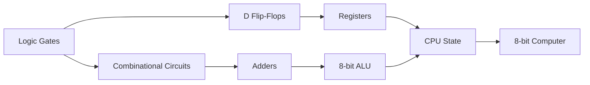

# Architecture Notes

This project models a small 8-bit computer as a set of connected digital hardware concepts. The implementation is written in Python, but the execution model is organized around gates, buses, registers, RAM, an ALU, and a clocked control flow.

## Build-Up



The important idea is that the CPU is not treated as a black box. The simulator exposes the internal state so the user can see how data moves between memory, registers, the ALU, and output devices.

## Main Components

| Component | Role |
| --- | --- |
| Logic gates | Primitive boolean operations used to construct higher-level circuits. |
| ALU | Performs arithmetic, subtraction, comparisons, and flag updates. |
| D flip-flops | Latch register values on rising clock edges. |
| Registers | Store PC, MAR, IR, A, B, output, and intermediate state. |
| RAM | Stores instructions and data. |
| Bus | Moves 8-bit values between RAM, registers, ALU, and output. |
| Instruction decoder | Maps opcodes to CPU operations. |
| Display output | Renders output through LEDs, 7-segment display, or graphic RAM. |

## Data Path

```text
Assembly Program
      |
      v
parse_program()
      |
      v
RAM -> Bus -> IR -> Decoder
      |             |
      v             v
     MAR          ALU / Control
      ^             |
      |             v
      PC        Registers -> Output
```

## Base Simulator

`src/8bit_computer.py` focuses on the CPU data path:

- clock
- program counter
- memory address register
- instruction register
- A/B registers
- shared bus
- output register
- carry, zero, greater, and less flags
- RAM preview
- 7-segment display output

## Graphic Simulator

`src/8bit_computer_graphic.py` extends the base CPU model with a larger RAM layout and an 8x8 graphic display. The display reads bytes from graphic RAM and treats each bit as a pixel.

```text
Graphic RAM 0xE0-0xE7
      |
      v
8 bytes, one row per byte
      |
      v
8x8 pixel display
```

The `STG` instruction stores A-register values into RAM addresses used by the graphic display.
